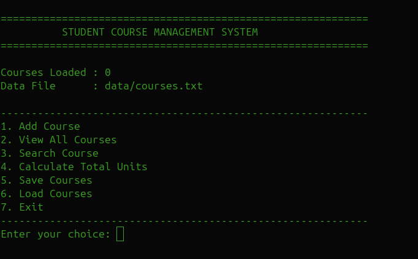
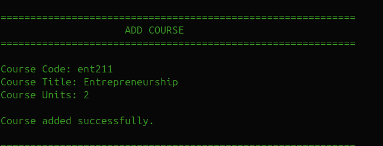
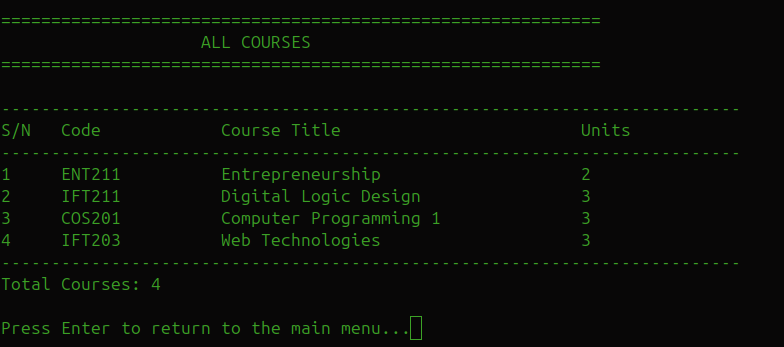
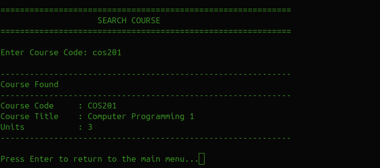
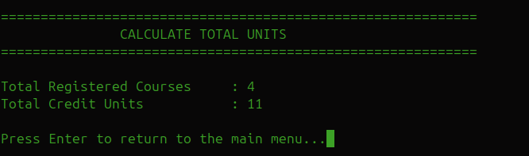
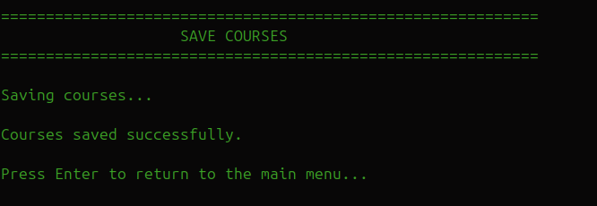
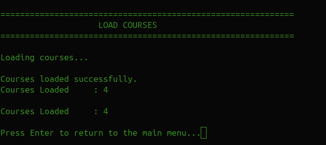
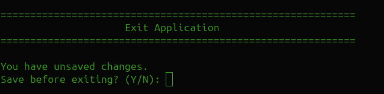

#  Student Course Management System

> A clean, modular Java console application for managing academic courses with persistent file storage, recursive searching, and a user-friendly menu-driven interface.

---

## 📖 Overview

The **Student Course Management System** is a lightweight Java console application designed to simplify the management of academic course records.

Users can add new courses, search for existing courses, view all registered courses, calculate the total number of credit units, and save or load course information using a persistent text file.

The application follows a modular architecture that separates the data model, business logic, and user interface, making the codebase easier to understand, maintain, and extend.

Whether you're learning Java, exploring object-oriented programming, or looking for a simple reference implementation of a console-based CRUD application with file persistence, this project provides a practical and easy-to-follow example.

---

## ✨ Features

- ✅ Add new courses
- ✅ Prevent duplicate course codes
- ✅ View all registered courses
- ✅ Search courses by code using recursion
- ✅ Calculate total registered credit units
- ✅ Save course records to a text file
- ✅ Load saved course records
- ✅ Input validation for user entries
- ✅ Unsaved changes detection before exit
- ✅ Clean, menu-driven console interface
- ✅ Modular and maintainable project structure

---

## 🖼️ Screenshots

### Main Menu

The application's central dashboard provides quick access to every feature through a simple numbered menu.

---

### Add Course

Register a new course by entering its code, title, and credit units. Duplicate course codes are automatically rejected.

---

### View All Courses

Display every registered course in a neatly formatted table showing the course code, title, and credit units.

---

### Search Course

Locate any registered course using its course code. This feature is powered by a recursive search algorithm.

---

### Calculate Total Units

Instantly calculate the total number of registered courses and the combined credit units.

---

### Save Courses

Save all registered courses to persistent storage for future use.

---

### Load Courses

Reload previously saved courses into the application.

---

### Unsaved Changes Detection

Before closing the application, users are prompted to save any unsaved changes, helping prevent accidental data loss.

---

## 🚀 Technologies Used

- Java 21+
- Object-Oriented Programming (OOP)
- Java Collections (`ArrayList`)
- File Handling (`BufferedReader`, `BufferedWriter`)
- Exception Handling
- Recursion
- IntelliJ IDEA
- Git & GitHub
